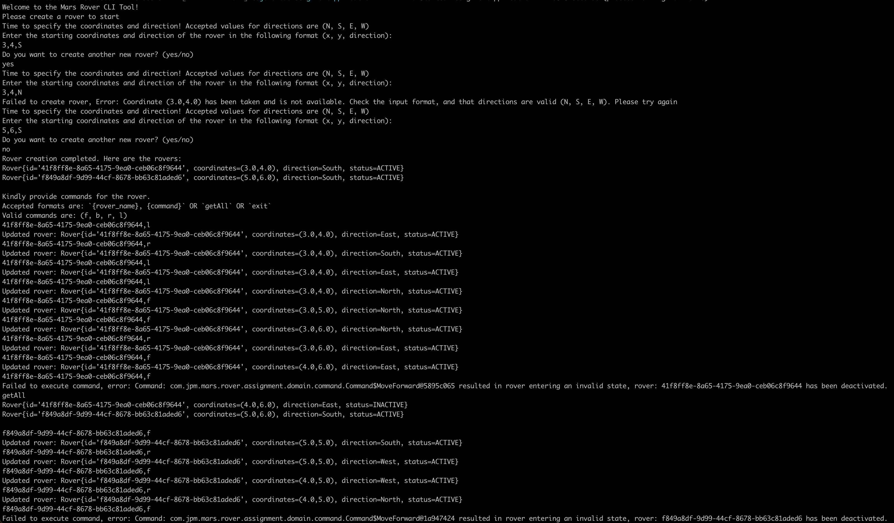

# Mars Rover CLI Tool

This is a Spring Boot application for the mars rover using Maven as the build tool.

## Description

The Mars rover can be created using the CLI tool, where you will need to specify the starting coordinate and direction of the Mars rover.
Multiple rovers can be created one at a time using the CLI tool.
It is not possible to create more rovers once all the rovers has been initially created using the CLI tool.
If commands are sent which causes rovers to collide with one another, the offending rover will be deactivated and remain at it's location. Subsequent commands for the offending rover will be ignored.


## Prerequisites

Before running this application, ensure that you have the following installed:

- Java JDK (version 21.0.2 or higher)
- Maven (version 3.9.6 or higher)

## Building the application

To build the project, navigate to the assignment directory of the project and run the following Maven command:
```
mvn clean package
```

## Usage

### Running the Application

To run the Spring Boot application, navigate to the assignment directory of the project after building the application and run the following command:

```
java -jar target/assignment-0.0.1-SNAPSHOT.jar
```

### Utilizing the CLI Program

1. Ensure that the Spring Boot application is running.
1. Create the rover according to the instructions on the CLI tool
1. Press enter after entering the required details


